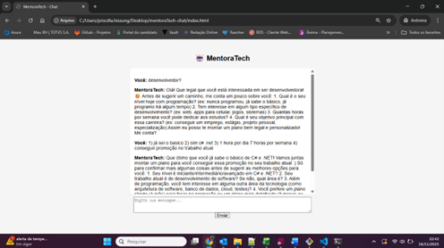
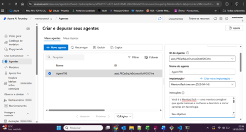
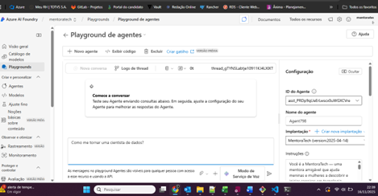
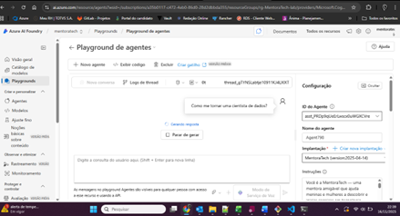
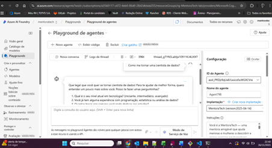

# MentoraTech
*Descrição: Tela principal da aplicação final.*

*Descrição: Tela de cariação do agent, no Azure AI Foundry.*

*Descrição: Tela de testes no playground.*

*Descrição: Tela de testes no playground, realização da pergunta.*

*Descrição: Tela de testes no playground, resposta recebida.*

